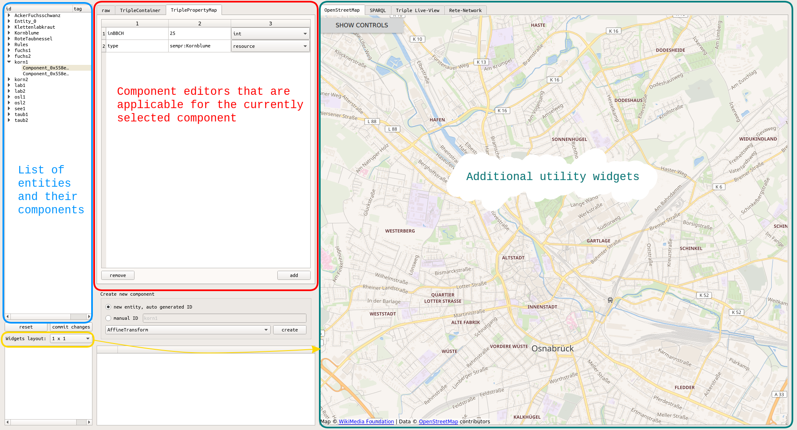
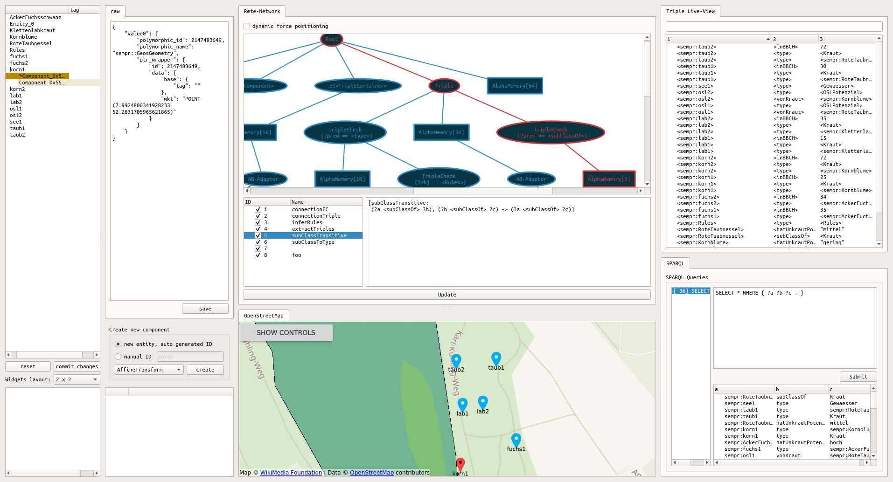
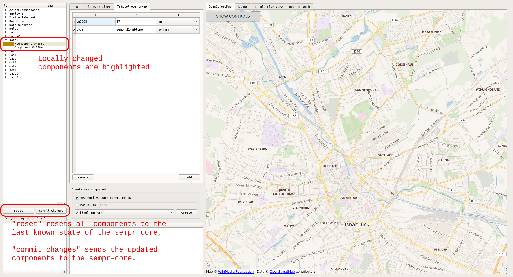

## SEMPR-GUI
The title is almost self-explaining. This project provides a graphical user-interface to the sempr-core. It contains a definition of an interface between those two, and an implementation of such an interface that establishes a network connection using ZeroMQ. 

The basic principle behind the gui is the following: All your data in sempr is represented in components, which are serializable to json. This is what is transmitted via the interface, and the gui can then list all the components. Even if itself fails to parse the json (as it might not know the component type), it can still provide this textual information to you. If it recognizes the component type and additionally has a widget specialized to display and edit it, that will be shown to you. 



Next to the list of entities and the component editors are a few additional utility widgets. These include a OpenStreetMap view, which (stupidly) assumes that all geometries have lon/lat coordinates which are shown here; a form to submit SPARQL queries (note that this is a **read only** view on the internally stored triples); a searchable list of all triples (which is updated live), and a representation of the internally constructed rete network that implements the rules that are currently active in the reasoner.

All three areas are horizonatlly size-adjustable, and the pane for the additional utility widgets can be split in up to 2x2 widgets using the "Widgets layout"-selection. The tabs can be reordered and be moved between those widgets with drag & drop:



Be aware that modifications to components made through the editors or the OpenStreetMap view are not sent to the sempr-core directly. Instead, those changes are first stored locally. You can then either commit all made changes to the sempr-core using the "commit changes" button, or reset everything to the last known state of the core with "reset".




### Connecting to a sempr-core

A bit of overhead is needed to actually connect your own sempr-core-application (remember, sempr-core is a library, not an executable), to the gui. You will need to tell it to actually send updates on internal changes, and you need to tell it where to send them to.

First, create a DirectConnection object. This hooks directly to the sempr core and provides the interface needed for the gui to work. To avoid problems with parallel access to sempr make sure to use a mutex:

```c++
std::mutex semprMutex;
auto connection = std::make_shared<DirectConnection>(&core, semprMutex);
```

> Note: The code is taken from ExampleServer.cpp, which uses the namespaces `sempr` and `sempr::gui`.

With this, you could already create a gui instance and hand it the connection object (though no updates would be sent, more on that soon!). But let's assume you want to be able to connect to the core from outside your application, e.g. using a network connection. In this case, what we need is a server that exports the `DirectConnection` interface:

```c++
TCPConnectionServer server(connection);
server.start();
```
This starts a separate thread which handles explicit requests from the gui, e.g. to list all components, or to send it the current state of the rete network. But still, this is only part of what is needed. What we also want is to send an update to all connectetd clients whenever a component is updated -- even one that is only inferred and not persisted -- or new triples have been inferred or were revoked.

Guess what: There is a rule for that.

Two rules, to be exact. You will need to create nodes that use the connection object to send updates whenever they are triggered, and to
construct those you need the corresponding builders:

```c++
rete::RuleParser& parser = sempr.parser();
parser.registerNodeBuilder<DirectConnectionBuilder>(connection);
parser.registerNodeBuilder<DirectConnectionTripleBuilder>(connection);
```

In order to finally make the connection we need to insert those into the reasoner:

```c++
sempr.addRules(
	"[connectionEC: EC<Component>(?e ?c) -> DirectConnection(?e ?c)]"
	"[connectionTriple: (?s ?p ?o) -> DirectConnectionTriple(?s ?p ?o)]"
);
```

And that's it! Well, yeah, quite a few steps were necessary. But now, whenever you call `sempr.performInference()`, all updates are also sent over the network to any connected gui-client.

For the client you can actually use the `sempr-gui-example-client`, and pass it the network address of the machine the core is running on as the first and only commandline argument, or leave it as it defaults to "localhost".